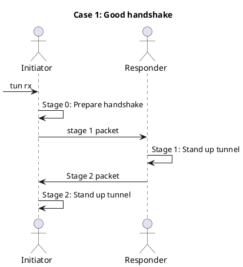
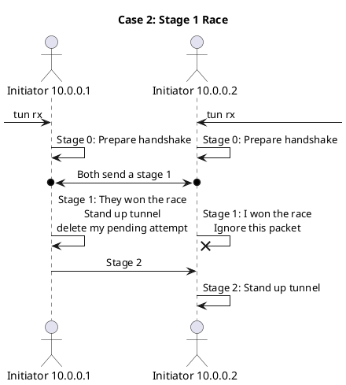
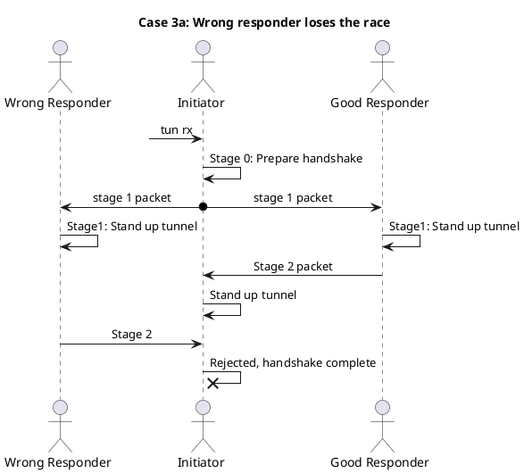
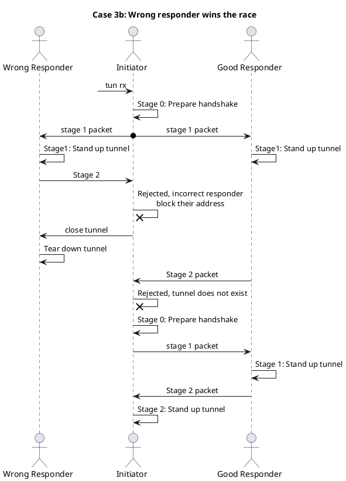

# Handshakes studies

This is an incomplete set of handshake possibilities

## Case 1: A good handshake

## Case 2: Stage 1 Race

Both sides try initiating at roughly the same time

Race avoidance is necessary, if we don't catch this at stage 1 then
both sides will have a tunnel with incorrect symmetric keys

## Case 3: Wrong responder

This affects nodes that have incorrect information about how to reach a given vpn ip

This avoidance behavior is specific to v1.4 and beyond.

### Case 3a: The correct host responds first

In this situation we are saved by the handshake already being complete however
the wrong responder believes they have a tunnel. If the wrong responder
attempts to send any messages our initiator will reply `recv_error` and eventually
the wrong responder will tear down it's broken tunnel.

### Case 3b: The wrong responder wins the race

In this case the wrong responder wins the race, we detect this, block their address
and begin the handshake process over again. The good responders stage 2 packet
will be ignored.

