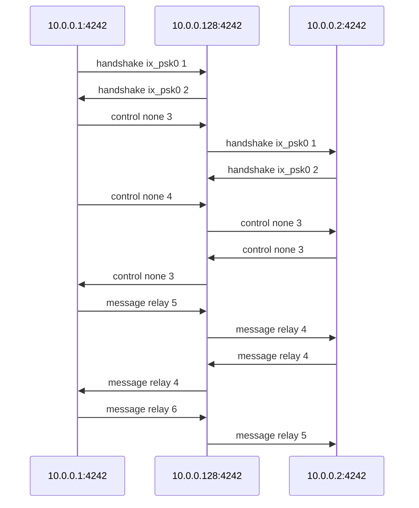

```mermaid
sequenceDiagram
    participant 10.0.0.1#58;4242
    participant 10.0.0.128#58;4242
    participant 10.0.0.2#58;4242
    10.0.0.1#58;4242->>10.0.0.128#58;4242: handshake ix_psk0 1
    10.0.0.128#58;4242->>10.0.0.1#58;4242: handshake ix_psk0 2
    10.0.0.1#58;4242->>10.0.0.128#58;4242: control none 3
    10.0.0.128#58;4242->>10.0.0.2#58;4242: handshake ix_psk0 1
    10.0.0.2#58;4242->>10.0.0.128#58;4242: handshake ix_psk0 2
    10.0.0.1#58;4242->>10.0.0.128#58;4242: control none 4
    10.0.0.128#58;4242->>10.0.0.2#58;4242: control none 3
    10.0.0.2#58;4242->>10.0.0.128#58;4242: control none 3
    10.0.0.128#58;4242->>10.0.0.1#58;4242: control none 3
    10.0.0.1#58;4242->>10.0.0.128#58;4242: message relay 5
    10.0.0.128#58;4242->>10.0.0.2#58;4242: message relay 4
    10.0.0.2#58;4242->>10.0.0.128#58;4242: message relay 4
    10.0.0.128#58;4242->>10.0.0.1#58;4242: message relay 4
    10.0.0.1#58;4242->>10.0.0.128#58;4242: message relay 6
    10.0.0.128#58;4242->>10.0.0.2#58;4242: message relay 5
```
